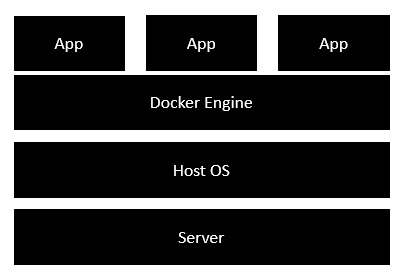

# Docker with SpringBoot

Docker is used to make application shippable.
## VM vs Docker:

VM Eg: vmWare, Microsoft Hyper V

### Reference: 
[VM vs Docker](https://www.tutorialspoint.com/docker/docker_architecture.htm)

## Installing Docker for Windows
 [Enable Hardware Virtualization in BIOS](https://stackoverflow.com/questions/39684974/docker-for-windows-error-hardware-assisted-virtualization-and-data-execution-p)
* [Docker Desktop For Windows](https://www.docker.com/products/docker-desktop)
  * For running Docker Engine
  * Installs WSL2 (Windows Sub System for Linux)
  
## Docker Terms:
* image
* container
* volume

# Steps for Creating and running a Docker application:
## 01) Create Executable jar
    java -jar docker-spring-boot.jar
    http://localhost:8080/demoapp/api/home/hello
    Running with port 8090
    java -jar docker-spring-boot.jar --server.port=8090
## 02) Create Docker File
    FROM : Base Docker Image 
  in https://hub.docker.com- automatic!
    
    ADD: Executable application to the Base docker image
    
    ENTRYPOINT: Command to be executed when you run the docker container
    
## 03) Build Docker Image
* Ensure docker is up :  
  *docker -v* / *docker --version*
* List current images :  
    *docker images*
* List running containers :  
  *docker container ls*
* Build the image :  
  *docker build -t dockersbootdemo .*
  
    Build image with tag name dockersbootdemo from current folder .
  
    Note: Image name should be in lower case
* List the images :  
  *docker images*

## 04) Run Docker Container
* List running processes :  
  *docker ps*
* running a new process :  
  *docker run -p8081:8090 dockersbootdemo*
  
    System port 8081 is mapped to the port 8090 in docker container (Virtual machine)
    http://localhost:8081/demoapp/api/home/hello

# Clean up Commands

- docker ps
- dcoker stop <ContainerID>
- docker rm <ContainerID>
- docker rmi -f <imageName>
